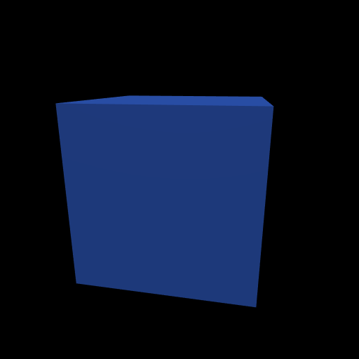

# Hello Cube

The simplest possible splendor-render program: create a context, set up a
camera, load a cube, add a light, and render.



## Python code

```python
from splendor.contexts.egl import EGLContext
from splendor.core import SplendorRender
from splendor.camera import projection_matrix, direction_light_pose
from splendor.image import save_image

ctx = EGLContext()
renderer = SplendorRender()

# Set up a camera with a 60° field of view
proj = projection_matrix(math.radians(60.), WIDTH / HEIGHT)
renderer.load_camera('main', view_matrix=[0.2, -0.3, 0, 4.0, 0, 0],
                     projection=proj)
renderer.load_sensor('rgb', 512, 512)

# Create a blue cube
renderer.load_mesh('cube', mesh_primitive={'shape': 'cube'},
                   color_mode='flat_color')
renderer.load_material('blue_mat', flat_color=(0.2, 0.4, 0.9),
                       metal=0.0, rough=0.4, base_reflect=0.04, ambient=0.15)
renderer.add_instance('cube', mesh_name='cube', material_name='blue_mat')

# Add a directional light
renderer.add_direction_light('sun',
    pose=direction_light_pose((1.0, -1.0, -0.5)),
    color=(1.2, 1.1, 1.0))
renderer.set_ambient_color((0.08, 0.08, 0.1))

# Render and save
renderer.color_render('main', sensor='rgb')
image = renderer.read_sensor('rgb')
save_image(image, 'hello_cube.png')
ctx.close()
```

## Key concepts

- **EGLContext** provides headless (offscreen) OpenGL. No window needed.
- **Camera** = a view matrix (where you're looking from) + projection matrix
  (lens properties). The `view_matrix` parameter accepts azimuthal shorthand:
  `[azimuth, elevation, tilt, distance, shift_x, shift_y]`.
- **Mesh** = geometry. `mesh_primitive` generates shapes procedurally.
  Available shapes: `cube`, `sphere`, `cylinder`, `disk`, `barrel`,
  `multi_cylinder`, `mesh_grid`.
- **Material** = surface appearance. `flat_color` sets a uniform color;
  PBR properties (`metal`, `rough`, `base_reflect`) control the shading model.
- **Instance** = a mesh + material placed in the scene with a transform.
- **Sensor** = a framebuffer to render into. `read_sensor` reads it back
  as a numpy array.

## Running it

```bash
python examples/01_hello_cube.py output.png
```

Source: [examples/01_hello_cube.py](../../examples/01_hello_cube.py)
