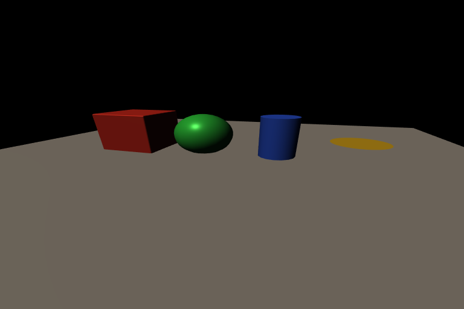

# Procedural Primitives

Splendor can generate meshes procedurally — no OBJ files needed.
This scene places one of each primitive type on a ground plane.



## Scene JSON

Meshes are defined with `mesh_primitive` instead of `mesh_path` or
`mesh_asset`:

```json
"meshes": {
    "cube": {
        "mesh_primitive": {"shape": "cube", "bezel": 0.05},
        "color_mode": "flat_color"
    },
    "sphere": {
        "mesh_primitive": {"shape": "sphere", "radius": 1.0},
        "color_mode": "flat_color"
    },
    "cylinder": {
        "mesh_primitive": {
            "shape": "cylinder",
            "start_height": 0, "end_height": 2.0,
            "radius": 0.6,
            "start_cap": true, "end_cap": true
        },
        "color_mode": "flat_color"
    },
    "disk": {
        "mesh_primitive": {"shape": "disk", "radius": 0.8},
        "color_mode": "flat_color"
    }
}
```

## Available shapes

| Shape | Key parameters |
|-------|---------------|
| `cube` | `x/y/z_extents`, `x/y/z_divisions`, `bezel` |
| `sphere` | `radius`, `height_divisions`, `radial_resolution`, `center` |
| `cylinder` | `start_height`, `end_height`, `radius`, `start_cap`, `end_cap` |
| `disk` | `radius`, `inner_radius`, `theta_extents`, `radial_resolution` |
| `barrel` | `height_extents`, `radius`, `theta_extents` |
| `multi_cylinder` | `start_height`, `sections` (list of (radius, height) tuples) |
| `mesh_grid` | `axes`, `x/y_extents`, `x/y_divisions` |

## Color modes

Each mesh specifies how its surface color is determined:

- `flat_color` — uniform color from the material's `flat_color` property
- `textured` — UV-mapped texture image
- `vertex_color` — per-vertex colors baked into the mesh

## Running it

```bash
splendor_render examples/02_primitives --output primitives.png --resolution 768x512

# Or in the interactive viewer:
splendor_viewer examples/02_primitives
```

Source: [examples/02_primitives.json](../../examples/02_primitives.json)
