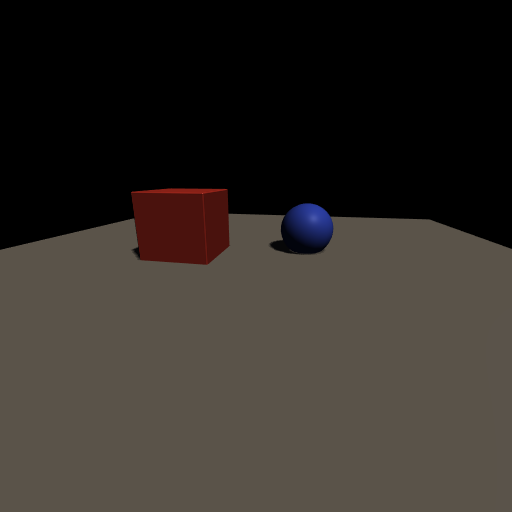

# Shadow Maps

Direction lights can cast shadows using depth-only sensors as shadow maps.
Shadows use percentage-closer filtering (PCF) for soft edges.



## How it works

1. Define a **depth-only sensor** (the shadow map framebuffer)
2. Attach it to a direction light with `shadow_map`, `shadow_projection`, and
   optionally `shadow_pcf_radius`
3. The renderer automatically renders a depth pass from the light's perspective
   before the main color pass, using back-face culling to avoid peter-panning

## Scene JSON

```json
"sensors": {
    "sun_shadow": {
        "width": 1024, "height": 1024,
        "depth_only": true, "anti_alias": false
    }
},
"direction_lights": {
    "sun": {
        "pose": [
            [-0.7071,  0.5774,  0.4082, 0.0],
            [-0.0,    -0.5774,  0.8165, 6.0],
            [ 0.7071,  0.5774,  0.4082, 0.0],
            [ 0.0,     0.0,     0.0,    1.0]
        ],
        "color": [1.3, 1.2, 1.0],
        "shadow_map": "sun_shadow",
        "shadow_projection": [
            [0.08, 0.0,  0.0,     0.0],
            [0.0,  0.08, 0.0,     0.0],
            [0.0,  0.0, -0.067, -1.007],
            [0.0,  0.0,  0.0,     1.0]
        ],
        "shadow_pcf_radius": 2
    }
}
```

## Shadow parameters

- **`shadow_map`** — name of a depth-only sensor to use as the shadow buffer
- **`shadow_projection`** — orthographic projection defining the shadow
  frustum coverage (wider = covers more area but lower resolution)
- **`shadow_pcf_radius`** — PCF kernel half-size (0 = hard shadows,
  1 = 3x3 filter, 2 = 5x5, etc.)
- **`pose`** — the light's pose matrix. The light shines along the +Z axis
  of this frame. The translation sets the shadow camera position.

## Tips

- Shadow resolution vs. coverage is a tradeoff. A 1024x1024 shadow map
  covering ±12 world units gives ~85 texels per unit. Tighten the
  projection for higher quality on smaller scenes.
- Up to 4 shadow-casting lights are supported simultaneously
  (shared across direction lights and IBL).
- Back-face culling in the shadow pass prevents self-shadowing artifacts
  without needing polygon offset.

## Running it

```bash
splendor_render examples/03_shadows --output shadows.png
splendor_viewer examples/03_shadows
```

Source: [examples/03_shadows.json](../../examples/03_shadows.json)
