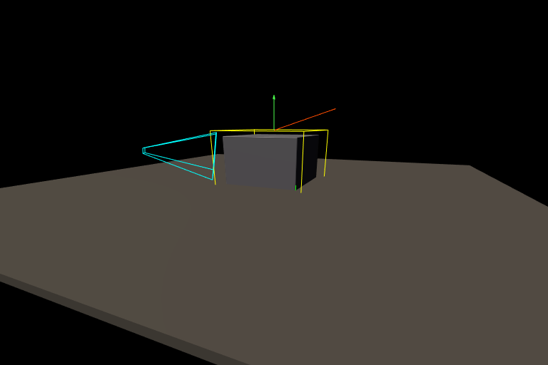

# Debug Overlays

Splendor provides line-based debug primitives that can be added to any scene
as persistent objects or drawn as one-shot calls. All overlay types render
through the same lens distortion as the rest of the geometry.



## Overlay types

| Type | Scene object | One-shot call | Description |
|------|-------------|---------------|-------------|
| Coordinate frame | `add_coord_frame` | `render_coord_frames` | RGB XYZ axes (+ magenta/yellow/cyan for negative) |
| Arrow | `add_arrow` | `render_arrows` | Line with a wedge tip |
| Box | `add_box` | `render_boxes` | Wireframe box (transform maps unit cube) |
| Frustum | `add_frustum` | `render_frustums` | Camera frustum wireframe from transform + projection |
| Line set | `add_line_set` | `render_line_sets` | Arbitrary colored line segments |
| Point cloud | `add_point_cloud` | `render_point_clouds` | Colored points |

## Scene JSON

Overlays can be specified directly in a scene file:

```json
"coord_frames": {
    "origin": {
        "transform": [[1,0,0,0],[0,1,0,0],[0,0,1,0],[0,0,0,1]],
        "axis_length": 0.5
    }
},
"arrows": {
    "velocity": {
        "start": [0, 2.2, 0],
        "end": [1.5, 3.0, -0.5],
        "color": [1, 0.3, 0],
        "wedge_size": 0.15
    }
},
"boxes": {
    "bounding_box": {
        "transform": [[1.2,0,0,0],[0,1.2,0,1],[0,0,1.2,0],[0,0,0,1]],
        "color": [1, 1, 0]
    }
}
```

## Python API

Scene objects persist across frames (useful for the interactive viewer):

```python
renderer.add_coord_frame('frame1', transform, axis_length=0.5)
renderer.add_arrow('vel', start=[0,0,0], end=[1,2,0], color=[1,0,0])
renderer.add_box('bbox', transform, color=[1,1,0])
renderer.add_frustum('cam', cam_transform, cam_projection, color=[0,1,1])
renderer.add_line_set('grid', starts, ends, colors)
renderer.add_point_cloud('pts', points, colors, point_size=3)
```

One-shot calls draw immediately without adding to the scene — useful for
quick debugging in scripts:

```python
renderer.color_render('main', sensor='rgb')  # render the scene first
renderer.render_arrows('main', starts, ends, colors)  # draw on top
image = renderer.read_sensor('rgb')  # read back includes the overlays
```

## Running it

```bash
splendor_render examples/04_debug_overlays --output overlays.png --resolution 768x512
splendor_viewer examples/04_debug_overlays
```

Source: [examples/04_debug_overlays.json](../../examples/04_debug_overlays.json)
