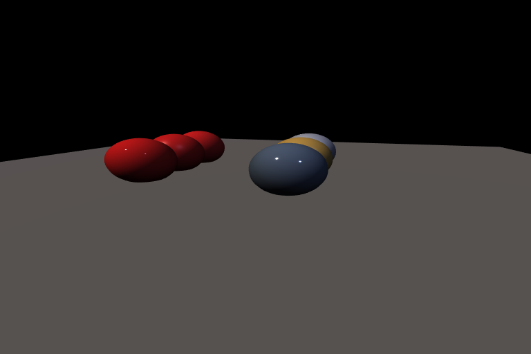

# PBR Materials

Splendor uses a Cook-Torrance physically-based rendering model.
Materials are controlled by four parameters that cover the range from
rough plastic to polished metal.



*Left column: plastic (rough → default → shiny). Right column: metal
(rough → gold → mirror).*

## Material parameters

| Parameter | Range | Description |
|-----------|-------|-------------|
| `flat_color` | RGB [0,1] | Base surface color |
| `metal` | 0–1 | 0 = dielectric (plastic), 1 = metallic |
| `rough` | 0–1 | Surface roughness (0 = mirror, 1 = matte) |
| `base_reflect` | 0–1 | Fresnel reflectance at normal incidence (typically 0.04 for dielectrics) |
| `ambient` | 0–1 | Contribution of ambient light |

## Scene JSON

```json
"materials": {
    "plastic_red": {
        "flat_color": [0.8, 0.1, 0.1],
        "metal": 0.0, "rough": 0.4, "base_reflect": 0.04, "ambient": 0.1
    },
    "metal_gold": {
        "flat_color": [1.0, 0.76, 0.34],
        "metal": 1.0, "rough": 0.3, "base_reflect": 0.04, "ambient": 0.05
    }
}
```

## Color modes

Beyond flat colors, splendor supports two other color modes:

**Textured** — UV-mapped image texture:
```json
"meshes": {"obj": {"mesh_path": "model.obj", "color_mode": "textured"}},
"textures": {"diffuse": {"texture_asset": "model_texture"}},
"materials": {"mat": {"texture_name": "diffuse", "metal": 0.0, "rough": 0.5}}
```

**Textured material properties** — a second texture encoding per-texel
metal/rough/reflect/ambient values, for spatially varying materials:
```json
"materials": {
    "mat": {
        "texture_name": "diffuse",
        "material_properties_texture": "matprop_texture"
    }
}
```

## Running it

```bash
splendor_render examples/05_materials --output materials.png --resolution 768x512
splendor_viewer examples/05_materials
```

Source: [examples/05_materials.json](../../examples/05_materials.json)
