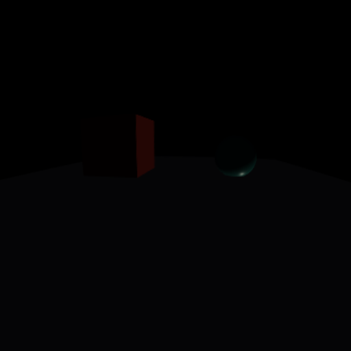

# Radial Distortion

Splendor can simulate camera lens distortion using a two-stage rendering
pipeline: render at an expanded field of view, then warp the result through
a radial distortion model.



## Distortion model

The distortion is controlled by two coefficients on the camera:

- **`radial_k1`** — first-order radial distortion. Negative values produce
  barrel distortion (fisheye-like), positive values produce pincushion.
- **`radial_k2`** — second-order term for finer control.

## Scene JSON

```json
"cameras": {
    "main": {
        "view_matrix": [0.15, -0.2, 0, 6.0, 0, 0],
        "radial_k1": -0.3,
        "radial_k2": 0.05
    }
}
```

The sensor must have `enable_radial_distortion` set (the viewer and
`splendor_render` handle this automatically when k1/k2 are nonzero).

## How the two-stage pipeline works

1. **Stage 1**: The scene is rendered into an intermediate framebuffer with
   an expanded field of view (to capture pixels that will be pulled inward
   by barrel distortion).
2. **Stage 2**: A fullscreen warp pass reads the intermediate render and
   applies the inverse distortion model to produce the final image, including
   depth warping for correct depth buffer values.

MSAA anti-aliasing is resolved between stages so the warp pass samples
a clean texture.

## Python API

```python
renderer.load_camera('main', projection=proj,
                     radial_k1=-0.3, radial_k2=0.05)
renderer.load_sensor('rgb', 512, 512, enable_radial_distortion=True)
renderer.color_render('main', sensor='rgb')
```

## Running it

```bash
splendor_render examples/06_radial_distortion distortion.png
splendor_viewer examples/06_radial_distortion
```

Source: [examples/06_radial_distortion.json](../../examples/06_radial_distortion.json)
