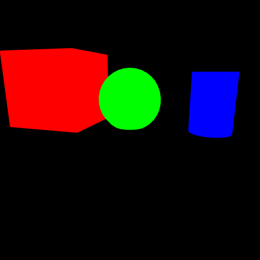

# Render Modes

Splendor can render the same scene in three modes: color (PBR shading),
mask (per-instance segmentation), and depth (linearized eye-space distance).

| Color | Mask | Depth |
|-------|------|-------|
|  |  |  |

## Color rendering

Standard PBR-shaded rendering with lighting, shadows, and reflections:

```python
renderer.color_render('main', sensor='rgb')
image = renderer.read_sensor('rgb')  # uint8 (H, W, 3)
```

## Mask rendering

Each instance is rendered in its `mask_color` — a unique flat color that
identifies the object. Useful for instance segmentation ground truth:

```python
renderer.mask_render('main', sensor='rgb')
mask = renderer.read_sensor('rgb')  # uint8 (H, W, 3)
```

Assign mask colors when adding instances:
```json
"instances": {
    "box":  {"mask_color": [1, 0, 0]},
    "ball": {"mask_color": [0, 1, 0]}
}
```

## Depth rendering

Read the depth buffer from a color render pass. Returns linearized
eye-space depth as float32:

```python
renderer.color_render('main', sensor='rgb')
depth = renderer.read_sensor('rgb', read_depth=True,
                             projection=projection_matrix)
# depth is float32 (H, W, 1), values in world units
```

## CLI usage

```bash
splendor_render examples/02_primitives color.png
splendor_render examples/02_primitives mask.png --render-mode mask
splendor_render examples/02_primitives depth.npy --render-mode depth
```

## Viewer hotkey

In the interactive viewer, press **M** to toggle between color and mask
rendering in real time.

## Running this example

```bash
python examples/07_render_modes.py output_prefix
# produces: output_prefix_color.png, output_prefix_mask.png,
#           output_prefix_depth.npy, output_prefix_depth_vis.png
```

Source: [examples/07_render_modes.py](../../examples/07_render_modes.py)
