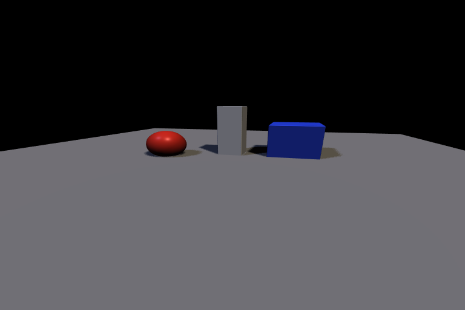

# Multiple Lights and Shadows

Splendor supports up to 8 direction lights and 8 point lights simultaneously.
Up to 4 of these can cast shadows, sharing a pool of shadow map slots.



*Warm key light from the left, cool fill light from the right.
Both cast independent shadows.*

## Scene JSON

Each shadow-casting light needs its own depth-only sensor:

```json
"sensors": {
    "key_shadow": {"width": 1024, "height": 1024, "depth_only": true},
    "fill_shadow": {"width": 512, "height": 512, "depth_only": true}
},
"direction_lights": {
    "key": {
        "color": [1.5, 1.4, 1.2],
        "shadow_map": "key_shadow",
        "shadow_projection": [...],
        "shadow_pcf_radius": 2
    },
    "fill": {
        "color": [0.4, 0.5, 0.8],
        "shadow_map": "fill_shadow",
        "shadow_projection": [...],
        "shadow_pcf_radius": 1
    }
}
```

## Shadow slot sharing

The 4 shadow map slots are shared across all light types:

- Direction lights claim slots in order (first light gets slot 0, etc.)
- The active image light (IBL) can also claim a slot for its shadow
- If more than 4 lights request shadows, the excess are rendered without

## Tips

- Use higher resolution for the key light shadow (it's the most visible)
  and lower resolution for fill/rim shadows.
- Colored lights create colored shadows where they overlap — a warm key
  with a cool fill produces natural-looking shadow tinting.
- Very low `ambient_color` makes shadows more dramatic; higher values
  make them softer.

## Running it

```bash
splendor_render examples/08_multi_light --output multi_light.png --resolution 768x512
splendor_viewer examples/08_multi_light
```

Source: [examples/08_multi_light.json](../../examples/08_multi_light.json)
