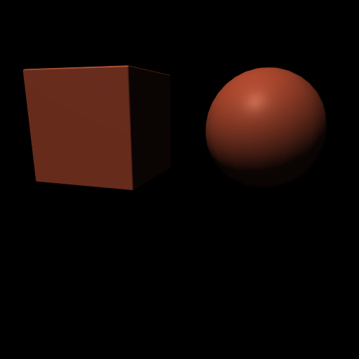
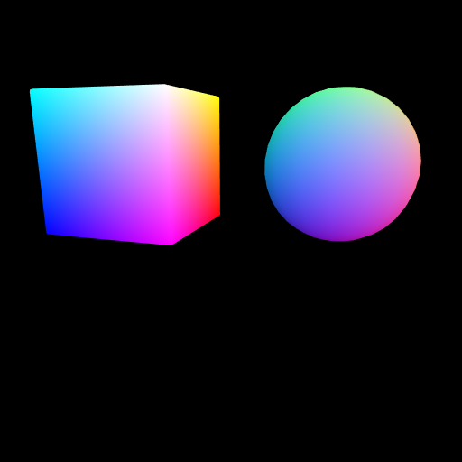

# Coordinate Rendering

The coordinate render mode outputs the object-space position of each
visible surface point, normalized to [0,1] within the instance's bounding
box. This provides dense spatial ground truth for tasks like pose
estimation, correspondence matching, and object-aware spatial reasoning.

| Color | Coordinate map |
|-------|----------------|
|  |  |

*Each pixel's RGB value in the coordinate map encodes the (x, y, z) position
on the object's surface within its bounding box.*

## How it works

Each instance defines a `coord_box` — a bounding box in the mesh's local
coordinate system. The coord shader normalizes each vertex position into
[0,1] within this box:

```
coord = (vertex_position - box_min) / (box_max - box_min)
```

The result is written as RGB, where R=x, G=y, B=z. Black pixels (0,0,0)
are at the box minimum corner; white pixels (1,1,1) are at the maximum.

## Setting coord_box

Specify the bounding box when adding an instance:

```python
renderer.add_instance('cube',
    mesh_name='cube',
    material_name='mat',
    transform=transform,
    mask_color=[1, 0, 0],
    coord_box=[[-1, -1, -1], [1, 1, 1]],  # match mesh extents
)
```

Or in JSON:
```json
"instances": {
    "cube": {
        "mesh_name": "cube",
        "material_name": "mat",
        "coord_box": [[-1, -1, -1], [1, 1, 1]]
    }
}
```

## Rendering

```python
# Render the coordinate map
renderer.coord_render('main', sensor='rgb')
coord_image = renderer.read_sensor('rgb')  # uint8 (H, W, 3)

# Convert back to coordinates:
# coords = coord_image / 255.0 * (box_max - box_min) + box_min
```

Note: coordinate rendering is a separate render call from color/mask — you
typically render the same scene in multiple modes to get paired data.

## Use cases

- **6DoF pose estimation** — train networks on dense coordinate targets
  instead of sparse keypoints
- **Correspondence** — match coordinate maps across viewpoints for the
  same object
- **Spatial queries** — look up the 3D position of any visible pixel

## Running this example

```bash
python examples/10_coord_render.py output_prefix
# produces: output_prefix_color.png, output_prefix_coords.png
```

Source: [examples/10_coord_render.py](../../examples/10_coord_render.py)
